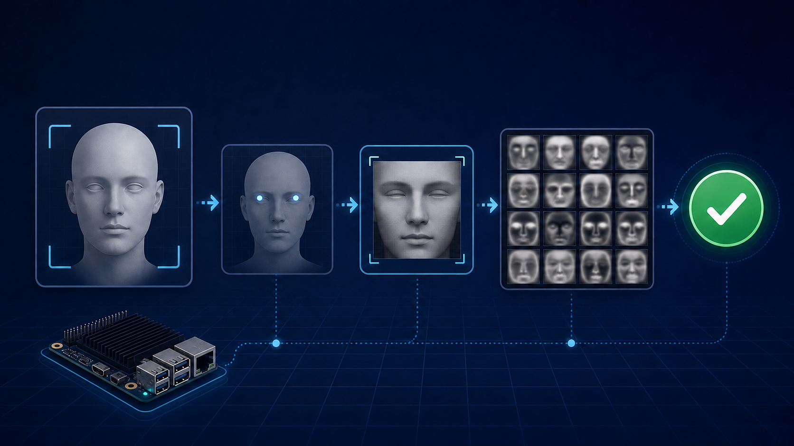

# TinyFace Verify



TinyFace Verify is a local, lightweight **1:1 face-verification** prototype
built with OpenCV, YuNet, and Eigenfaces/PCA. It is a learning project for
understanding image processing and classical machine-learning techniques—not a
production biometric-security product.

The project deliberately starts with the fundamentals rather than a large
pretrained deep-learning model. It walks through a complete face-verification
pipeline: collecting face images, validating and aligning them, modeling faces
with PCA/Eigenfaces, enrolling an owner, and verifying a new camera frame.

## Why This Project

I built TinyFace Verify to learn how an end-to-end computer-vision system is
put together and to explore the classical ideas behind **Eigenfaces**. The aim
is to make each stage observable and understandable:

```text
Collect -> Detect -> Validate -> Align -> Preprocess -> Model -> Enroll -> Verify
```

Although Eigenfaces is a small classical model, the resulting pipeline is
compact, fast to run locally, and a useful fit for experimenting on
resource-constrained or edge devices.

## Acknowledgment

This project was developed with guidance from **Nguyen Trong Van**, a mentor
with expertise in image processing. His feedback helped shape both the
technical approach and the learning process behind this implementation.

> Warning: the system has no liveness detection, is sensitive to illumination,
> and currently persists PCA templates with pickle. Do not use it for unlocking,
> attendance, access control, or protecting sensitive data.

## Problem

The system answers one question: does the face from the camera belong to the
enrolled owner?

```text
Camera -> face detection -> sample validation -> alignment -> PCA -> decision
```

This is a **1:1 verification** problem. Unlike 1:N identification, the system
compares the camera input with one enrolled owner template; it does not search
for the closest person in a user directory.

## Current Pipeline

1. `YuNetFaceDetector` detects faces and five landmarks.
2. `RuleBasedFaceSelector` selects the largest, most central face and rejects
   ambiguous frames containing multiple candidates.
3. `FaceSampleValidator` checks face size, image-edge margins, and sharpness
   using variance of the Laplacian.
4. `FaceAligner` uses the eye landmarks to normalize rotation, scale, and
   placement into a `112 x 112` image.
5. `FacePreprocessor` converts to grayscale, applies CLAHE, normalizes pixels
   to `0..1`, and flattens the image into a 12,544-element vector.
6. During enrollment, `EigenfaceModel` fits PCA from the owner's vectors.
7. During verification, the system reconstructs each query vector through PCA
   and calculates reconstruction MSE. A lower MSE than the threshold is
   accepted.

### Decision Metric

For a query image vector `x` and its PCA reconstruction `x_hat`:

```text
error = mean((x - x_hat)^2)
accept when error <= threshold
```

This is reconstruction error, not cosine similarity or a percentage of facial
similarity. Increasing the threshold makes the system easier to pass: FRR falls
while FAR rises.

## Requirements

- Python 3.10 or later.
- A webcam that OpenCV can open.
- Windows, macOS, or Linux with a suitable OpenCV GUI backend.

## Installation

```powershell
python -m venv venv
.\venv\Scripts\Activate.ps1
python -m pip install -r requirements.txt
```

On macOS/Linux, activate the environment with:

```bash
source venv/bin/activate
```

## Run the Camera Application

The current entry point is `src/main.py`.

```powershell
python -m src.main
```

### Enroll First

The repository does not contain an owner template. Before the first verification
run, enroll an owner to create the local file
`src/models/templates/owner_template.pkl`.

In `src/main.py`, set:

```python
system_mode = "Enrollment"
```

The system collects 20 valid images at least 0.3 seconds apart, fits PCA with
9 components, and saves a local template. Then change the mode to:

```python
system_mode = "Verify"
```

Camera controls:

- `q` or `Esc`: exit.
- `r`: discard currently collected samples and restart.

Note: `src/main.py` currently assigns `system_mode` twice, and the final
assignment selects `Verify`. Keep only one mode assignment when running it
manually.

## Offline Evaluation

Evaluation is separate from the camera runtime and uses the bundled ATT Faces
dataset. It measures one owner's reconstruction MSE against genuine holdout and
impostor samples.

```powershell
python -m src.scripts.evaluate_eigenface --owner-label 1
```

By default, for owner `s1`:

- The first five images are used for enrollment.
- The remaining five images are genuine holdout samples.
- The 390 images from the other 39 identities are impostor samples.
- The evaluation PCA model uses four components.

The output includes:

| Metric | Meaning |
| --- | --- |
| `Recommended threshold` | The threshold where FAR and FRR are closest on the current evaluation split. |
| `FAR` | The rate at which an impostor is accepted. Lower is better. |
| `FRR` | The rate at which the enrolled owner is rejected. Lower is better. |
| `BER` | The mean of FAR and FRR. |

### AT&T Faces Baseline

The following snapshot comes from the bundled AT&T Faces dataset for owner
label `1` (`s1`). It is a small, controlled benchmark intended to evaluate the
pipeline and threshold-selection workflow.

| Evaluation item | Result |
| --- | ---: |
| Owner label | `1` |
| Genuine samples | 5 |
| Impostor samples | 390 |
| False accept rate (FAR) | 0.77% |
| False reject rate (FRR) | 0.00% |
| Balanced error rate (BER) | 0.38% |

Current baseline threshold for `s1`:

```text
Recommended threshold: 0.036637
False accept rate: 0.77%
False reject rate: 0.00%
Balanced error rate: 0.38%
```

These numbers are only a PCA baseline on ATT Faces. Do not use this threshold
directly in the runtime: the default evaluation uses five images and four
components, while the runtime uses 20 images and nine components. See
[docs/evaluation.md](docs/evaluation.md) for the complete workflow.

## Tests

```powershell
python -m pytest tests -q
```

If the environment blocks pytest's default temporary directory, pass one with
write permission:

```powershell
python -m pytest tests -q --basetemp=.test-tmp
```

## Project Structure

```text
src/
  alignment/      Eye-landmark alignment
  camera/         Camera loop and pipeline orchestration
  capture/        Time-based frame collection and timeout
  detection/      YuNet face detection
  enrollment/     Sample collection and owner PCA training
  evaluation/     Offline MSE, FAR, and FRR benchmark
  eigenface/      PCA model, preprocessing, and ATT Faces loader
  selection/      Target-face selection among detections
  validation/     Sample-quality validation
  verification/  Reconstruction-error verification
tests/            Unit tests
data/raw/         ATT Faces benchmark dataset
```

## Limitations and Next Steps

- Eigenfaces/PCA operates on whole-image pixels and is sensitive to lighting,
  pose, expression, and occlusion.
- Twenty frames collected during one enrollment are not sufficiently diverse.
  Collect samples across different sessions, poses, and lighting conditions.
- There is no liveness detection; a printed photo or video shown on a screen may
  pass the pipeline.
- `pickle` is unsafe for untrusted input. Local templates are ignored by Git;
  before serious use, move to `.npz` with `allow_pickle=False`, validate the
  schema, and protect template files.
- For practical accuracy, retain YuNet for detection but replace PCA with a
  lightweight pretrained embedding model such as ArcFace or MobileFaceNet, then
  evaluate it with FAR, FRR, EER, or TAR at a target FAR.

## Related Documentation

- [Evaluation workflow](docs/evaluation.md)
- [Project roadmap](TODO.md)
- [OpenCV YuNet model](https://github.com/opencv/opencv_zoo/tree/main/models/face_detection_yunet)
